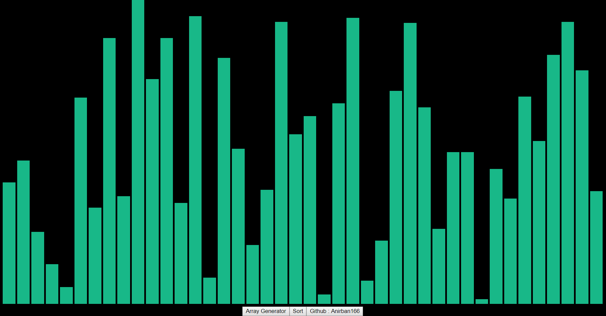
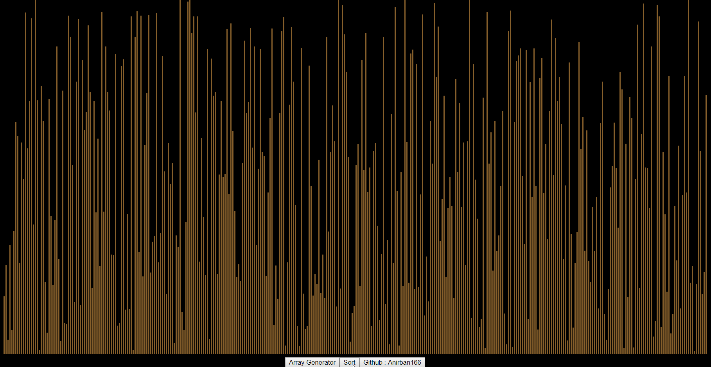

# VisualSort 
React based application (using node/npm) written in JS which sorts through an array with the whole process being represented visually through In-line block bars representing the values of array elements and an indicator which changes colour for the two elements being compared at a particular instant, making it easier for the viewer to review how the sorting actually takes place. Random arrays of a fixed number of elements can be generated using the Array Generator (array size alongwith other parameters such as block width, spacing and colour can be toggled within the main script).

